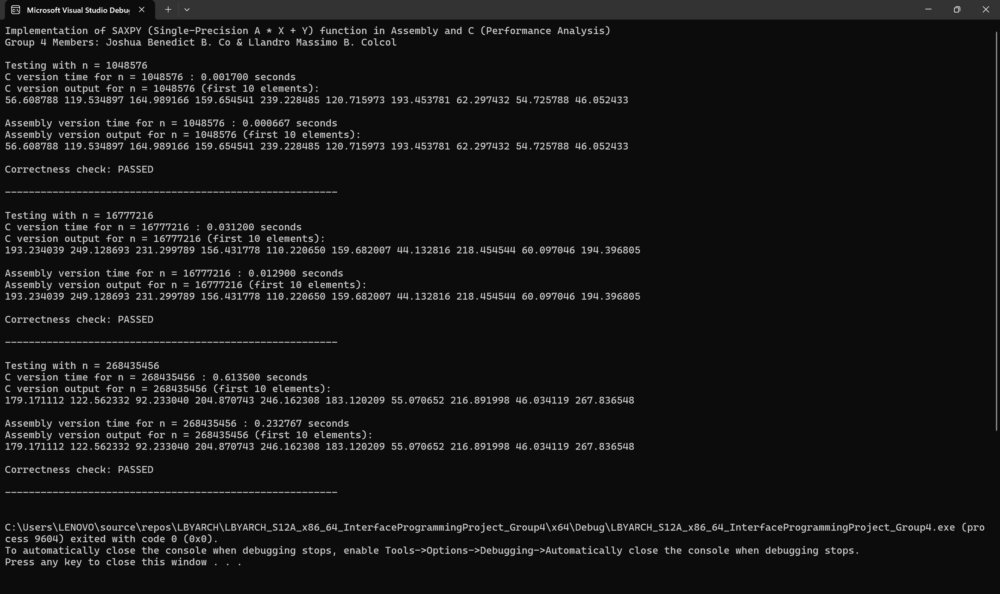

# LBYARCH-MP2-X86-C

**LBYARCH MP2 X86-C Interface Programming Repository**

**Group 4 Members:**  
- Joshua Benedict B. Co  
- Llandro Massimo B. Colcol

---

## 📌 Project Specification

This project implements a **SAXPY** (`Z[i] = A * X[i] + Y[i]`) kernel using:

- ✅ A C program implementation  
- ✅ An x86-64 assembly language implementation  

---

### 🔧 Requirements

- Use **functional scalar SIMD registers**
- Use **functional scalar SIMD floating-point instructions**

---

### 🧮 Input

- `n` — Length of vectors (integer)
- `A` — Scalar multiplier (single-precision float)
- `X`, `Y` — Input vectors (single-precision float)

---

### ⚙️ Process

Compute each element of output vector `Z` using the formula: (`Z[i] = A * X[i] + Y[i]`)

---

### 📤 Output

- Store result in vector `Z`
- Display the **first 10 elements** of `Z` for:
  - C version
  - x86-64 assembly version
 
---

### 📋 Comparative Analysis

|  n  |  C  |  Assembly  |
| :---: | :---: | :---: |
| 220 |  0.001700  |  0.000667  |
| 224 |  0.031200  |  0.012900  |
| 228 |  0.613500  |  0.232767  |

**Table 1. Summary of execution time and performance**

Insert Analysis here...

---

### 📷 Screenshot of Output

---

### 🔗 Link to Short Video Demo

Insert link here...

---
